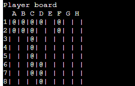
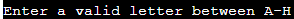

# Battleships

Battleships is a Python terminal game which is hosted on Heroku. It is based on the popular strategy type guessing game [Battleships](https://en.wikipedia.org/wiki/Battleship_(game)).

In this classic strategy game, players will go head-to-head against the computer, attempting to outmaneuver and outshoot each other to sink the opposing fleet. The game is clear: guess the locations of the computer's ships on the board before the computer can do the same to the player.

The live link can be found here - [Battleships](https://battleshipspp3.herokuapp.com/)

# Table of Contents

* [How to Play](#How-To-Play)
* [Features](#Features)
  * [Existing Features](#Existing-Features)
  * [Future Features](#Future-Features)
* [Design](#Design)
* [Technologies](#Technologies)
* [Data Model](#Data-Model)
* [Testing](#Testing)
  * [PEP8 Validation](#pep8-validation)
  * [Bugs](#bugs)
* [Deployment](#Deployment)
* [Credits](#credits)

# How To Play
* Players and the computer will have 5 ships each which consists of the following:
  * Destroyer (Takes up 2 board positions)
  * Submarine (Takes up 3 board positions)
  * Cruiser (Takes up 3 board positions)
  * Battleship (Takes up 4 board positions)
  * Carrier (Takes up 5 board positions)
- 5 ships will be placed on each board automatically.
- When all ships have been placed, the game will begin.
- The player must try and guess where the computers ships are located using coordinates.
- If the player can sink all the computers ships before theirs are sunk, they will win the game.

[Back to top](<#Table of Contents>)

# Features
## Existing Features
- The Introduction
  - When a new game is started, a Battleships logo is printed.
  
  
  
  - After the logo is printed, a simple welcome message which reads "Welcome to Battleships!" follows.
  
  

  - Player will then be asked if they have played the game before. If they have, the game instructions will be skipped and they will be taken directly to the game.

  
  
  - If the player has not played the game before, they will get the game instructions.
  
  
  
  - Player will get information on all the ship sizes and names that will be used in the game.
  
  
  
  - Player will also get a game legend which tells them the meaning behind the characters used on the board.
  
  

[Back to top](<#Table of Contents>)

- Players board
  - The players board will have letters and numbers on the x and y axis respectively. These will be the game coordinates.
  - The players ships will be visible. Ships have been randomly placed.

- Computers board
  - The computers board will have letter and numbers on the x and y axis respectively. These will be the game coordinates for the game.
  - The computers ships will not be visible. Reason for this is because the player will need to guess where the ships are located. Ships have been randomly placed.

[Back to top](<#Table of Contents>)

- Legend Display
  - Ships that have not been hit on the players board are displayed as a "@"
  - Ships that have been hit on both the players and computers boards are displayed as a "X"
  - Missed hits are displayed as a "O" on both the players and computers board

- Players board ingame

- Computers board ingame

[Back to top](<#Table of Contents>)

- Player feedback
  - Feedback is constantly displayed to the player during the game
  - The player must enter coordinates during their turn. They enter the y-axis first, which should be a number between 1 and 8. If they enter an invalid number, they are prompted to enter a valid one. Once the y-axis coordinate is correct, they enter the x-axis coordinate which should be a letter between A and H. If they enter an invalid letter, they are prompted to enter a valid one. After entering the correct coordinates, the player takes their turn and the computer takes its turn immediately after.
  - Once the player and computer have taken their turns, the player receives feedback. The feedback indicates whether they hit or missed the computer's ship and also whether the computer hit or missed their ship.
  - After the game is over, the player receives feedback about the outcome. They are told whether they won or lost.

- Y-axis request

- Y-axis feedback

- X-axis request

- X-axis feedback

- Player hitting ship

- Player missing ship

- Computer hitting ship

- Computer missing ship

- Game over

[Back to top](<#Table of Contents>)

- Play again
  - When the player or the computer has sunk the opponents ship, the game will end.
  - Once game has ended, the player will be asked if they want to play again. The player will need to input Y for yes or N for no.
  - If the player decides to play again, the game will reload.
  - If the player decides against playing again, they will get a goodbye message.

- Play again

- Goodbye

[Back to top](<#Table of Contents>)

## Future Features
- In the future, I would like to add the following features
  - Add a username input which would ask the player to create a username for the game
  - Add a highscore table which would go hand in hand with the username input feature. The scoreboard can be used for how many hits it took to win the game.
  - Add difficulty levels that the player can choose from.
  - Allow the player to position their ships.
  - Allow the player to choose the size of the grid.

[Back to top](<#Table of Contents>)

# Design
* When thinking about the design for this project, I had a look at various examples online and thought it would be good to keep it simple 
seeing as it was going to be a game on a terminal which normally consists of a simple black background and white text. I did however, decide to add abit of color for better 
UX.
- I made the battleships logo at the beginning red which I thought was a subtle color that went nicely with the black background.
- Before the game has started, I have given the player information on the ships and their lengths that they will have during the game. I have colored the ship names in different colors, this was to differentiate between the different ships and I felt makes it easier for player to see the differences.
- During the game, the player gets feedback on if they have hit or missed any ships aswell as feedback if their ships have been hit or missed. 
- When the player hits a ship, they will receive feedback in green. Reason for this is that this color is often associated with positive outcomes or a "go" signal.
- If the player's ships have been hit, they will receive feedback in red. Reason for this is that this color is often associated with danger or negative outcomes.
- The feedback for hitting empty waters for both the player and computer will be the color blue which is the color of the ocean.
- At the end of the game, if the player has won, the feedback given is in green and if the player loses, the feedback will be in red.

[Back to top](<#Table of Contents>)

# Technologies
* Languages
  - Python - Provides the functionality for the application

* Frameworks & Software
  - Github - Used to host and edit the application
  - Gitbash - Terminal in Gitpod used to push changes to the Github Repository.
  - Heroku - A cloud platform that the application is deployed to.
  - Lucidchart - A platform to create the logical flow chart for the game

* Python Packages
  - Sys - This module provides access to some variables used or maintained by the interpreter and to functions that interact strongly with the interpreter. It is always available. [docs.python.org](https://docs.python.org/3/library/sys.html#:~:text=This%20module%20provides%20access%20to,It%20is%20always%20available.)
  - Time - A module that provides various time-related functions.
  - Random - A module that will generate random numbers.

[Back to top](<#Table of Contents>)

# Data Model
- This is the logical flow chart for the game. This was a huge help in my app development as it was always at hand to show me how the game should come together.

[Back to top](<#Table of Contents>)

# Testing
  - Testing and debugging has been performed throughout the building phase via the gitpod terminal. Proof of this is within the commits.
  - Tested in the gitpod terminal and CI Heroku terminal.
  - Testing has also been done by myself, my friends, my family and within the Slack Community. There are no known issues that cause the application to crash.

## PEP8 Validation
  - Code was run though the Code Institute PEP8 Validator and below are the screenshots of the results.
  - Most of the errors were trailing white lines or 1 blank line rather than 2 under functions. These were all resolved.
  - The remaining errors are because of the logo and do not cause the code to break.

- PEP8 errors

- PEP8 errors

- PEP8 after the errors were fixed

# Bugs
## Resolved
  - The game would end directly after the player has taken their first turn. This was resolved by reindenting my code underneath a while loop and then adding an if condition.
  - There was an issue with the ships printing on both boards. The ships were printing on the computers board which should not happen and the ships on the players board were appearing after the computer has taken its first turn. This was fixed by reindenting my code underneath a while loop.
  - During the game, when trying to hit computers ships, it always showed I did not hit any ships at all but then all of a sudden I have sunk all the computers ships and won.
  This was fixed by adding a print ship function to the computers board. This led to another issue of the ships on the computers board being visible. I then had to edit my code within the print board function so that '@'(Ships) would be replaced with ' ' which led to all ships on the computer board being hidden.
  - The player was targeting their own board. This was fixed by redoing my start game function and going through each step at a time while putting the code in the order the game should be played out. Code was also reindented underneath a while loop.

## Unresolved
  - There are no known unresolved bugs to mention.

[Back to top](<#Table of Contents>)

# Deployment
* The app was deployed via Heroku and the live link can be found here [Battleships Game](insert link here)
  - To deploy the project through Heroku, the following steps were taken:
    - Sign up / Log in to [Heroku](https://www.heroku.com/)
    - From the main Heroku Dashboard, press the 'New' button and then press on the 'Create New App' button.
    - Give the project a name (Needs to be a unique name) and then select the region that is suitable to you. After this is done, press on the 'Create App' button.
    - Once the app has been created, you will be redirected to the deploy section. Using the submenu at the top, press on the settings button.
    - Once on the settings page, scroll down a to the 'Config vars' section. Once located, press on the 'Reveal congfig vars' button. This will reveal the current config vars for the app. There should not be any vars configured beforehand.
    - In the KEY input field, input PORT in capital letters and in the VALUE field, input 8000. Then click on the 'Add' button. This needs to be done for the Code Institute template. If you are not using the CI template, you may not need to do this.
    - Next, you need to click on the 'Add buildpack' button below. This should trigger a popup. Select Python as your first buildpack and press on the 'save changes' button.
    - Repeat the above step but this time select Node.js as the buildpack. The order of the buildpacks is important. Python should be first and Node.js second. If you accidently do them in the wrong order, you can click on either buildpacks and drag them to put them in the correct order.
    - Next, you need to navigate to the deploy page which you can do from the submenu at the top of the page.
    - Once on the deploy page, look for the deployment method section and press on the Github logo. Once done, a small section should appear underneath. Click on the 'Connect to GitHub' button. On your first time doing this, you may be promted to follow some steps which you should do.
    - Once done, a 'Connect to GitHub section should appear. Here you will need to search for the repository you want to connect to. You can either type in the repository name in the input field and press search or you can just press search right away and a list of all your repositories should appear and you can press on the one you would like to connect to. Once you have have found the repository you would like to connect to, press on the 'Connect' button on the right hand side.
    - Now that your app has been connected to GitHub, double check the 'Choose a branch deploy' drop down menu is deploying the correct branch from your GitHub Repository. Once you are sure, you need to decide if you would like to enable automatic deploys via the 'Enable Automatic Deploys' button below or if you would like to deploy it manually everytime. The difference is, with automatic deploy, your app will be updated automatically everytime you push the changes in GitHub where as with manual deploy, you will need to go back to the deploy page everytime you want to update the app with the changes. I prefer for it to be automatically done but it is entirely upto you.
    - Once you have decided how you want the deploys to be, press on the deploy branch below. Heroku will now build the app for you. Once it has been completed, a 'Your App Was Successfully Deployed' message will appear with a link the live site.

[Back to top](<#Table of Contents>)

# Credits
- Inspiration for my battleships game came from [Copyassignment](https://copyassignment.com/battleship-game-code-in-python/)
- GitHub template came from [Code Institute](https://codeinstitute.net)
- Colors used in my repository came from [Gist][gist.github.com/minism/1590432]
- I was able to solve some of the bugs I encountered by searching on [Stack OverFlow](https://stackoverflow.com/)
- The tutors at [Code Institute](https://codeinstitute.net) for always being there when ever I was stuck. A special thank you to Rebecca and Sarah for being patient and really taking their time to help me find where my code was breaking!
- The [Slack Community](https://slack.com) for also helping me resolve bugs and for testing my app throughout!
- My mentor [Precious Ijege](https://www.linkedin.com/in/precious-ijege-908a00168/) for giving me great feedback on how to improve my game!

[Back to top](<#Table of Contents>)

This game was done as part of my project piece for my Full Stack Software Development Diploma at the [Code Institute](https://codeinstitute.net).
Mustafa Habet 2023

